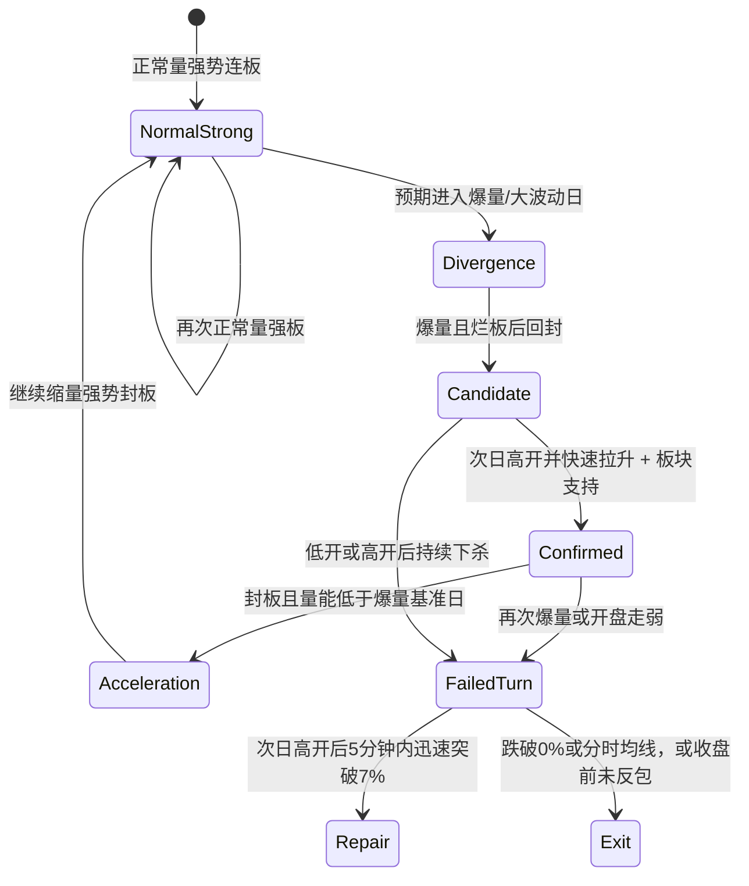

# 连板模式：选股与卖点逻辑知识库

## 0. 使用边界

这份知识库只总结两份来源材料中的**短线连板模式**，不适用于趋势股、首板、低吸、中长线、可转债或其他交易模式。

它是一套概率框架，不是“满足条件必涨”的预测公式。Claude Code 在分析、回测或生成规则时，必须：

1. 先判断场景，再调用阈值，禁止脱离上下文单独使用 `0%`、`5%`、`7%`。
2. 把“爆量烂板”视为候选事件，不视为自动买点。
3. 把次日竞价、开盘动作、量能和板块效应视为确认条件。
4. 把卖点理解为“预期没有兑现”或“分歧再次扩大”，而不是机械止盈。
5. 对来源未给出精确定义的参数保留为可配置项，不擅自伪造固定数值。
6. 把模式失效和市场适应纳入评估。来源特别提醒：模式一旦被程序化捕捉并被广泛使用，原有优势可能衰减。

> 风险提示：本资料是对给定材料的知识工程化整理，不构成投资建议，也不保证规则在未来市场中有效。

## 1. 一句话总纲

**先用封板质量和量能判断个股处于一致、分歧还是修复；再用次日竞价和开盘走势验证是否完成弱转强；卖点则出现在预期落空、关键强度丢失或量能再次爆发导致分歧延续之时。**

两份材料其实讲的是同一条链：

```text
一致上涨
  -> 爆量烂板，出现大分歧
  -> 次日高开并快速走强，形成预期差
  -> 缩量封板，确认弱转强和加速
  -> 继续享受溢价

任何一步未完成：降低预期、减仓或退出。
```

其核心不是“烂板一定出妖”，而是：

- 市场通常把烂板理解为弱；
- 若次日反而高开并迅速转强，就形成预期差；
- 若转强时量能缩小，说明昨日巨大分歧被有效消化；
- 若同时有板块热度支撑，个股更容易得到持续的短线资金关注；
- 若转强日再次爆量，说明分歧没有结束，所谓转强可能失败。

## 2. 统一术语

| 术语 | 本知识库中的含义 | 工程化注意事项 |
|---|---|---|
| 连板 | 个股处于连续涨停的短线接力序列 | 来源未给出最低板数，不要擅自把所有规则限定为某个固定板数 |
| 强势封板 | 封住涨停后没有明显漏单、开板，日K量柱通常为正常量 | 需要盘口或逐笔/分时数据，只有日K时不能完全识别 |
| 烂板/弱势板 | 盘中冲板后炸板，随后回封涨停；体现日内分歧 | 可用触板、开板次数、开板时长、最终是否回封描述，但来源未给出硬阈值 |
| 爆量 | 单日成交量达到近期最高，并且较前一日明显放大 | 来源举过“约2倍量”的明显案例，但没有规定统一倍数；倍数应可配置 |
| 正常量 | 没有出现明显异常放大的量能状态 | 应结合个股自身近期量能，不宜跨股票使用绝对值 |
| 缩量 | 当前成交量低于指定的爆量基准日 | 必须记录比较对象 `reference_explosion_day` |
| 再次爆量 | 弱转强日的量能接近或超过前一爆量烂板日 | 表示连续分歧，是重要卖出/降级信号 |
| 弱转强 | 前一日弱势、烂板或炸板，次日通过高开和快速拉升证明强度恢复 | 高开只是信号，开盘后的迅速拉升才是确认 |
| 板块效应 | 所属题材/板块有热度和联动，为个股延续提供资金与情绪支撑 | 来源未定义量化公式；可以另建板块强度评分，但必须标记为工程化扩展 |
| 分时均线 | 来源图中的黄色均线，类似当日成交均价线 | 用作失败后修复行情中的动态退出线 |
| 0%线 | 昨收价，即红盘与绿盘的分界 | 适用于“高开后下杀”的保住红盘规则，不是所有场景的通用止损 |
| 5%线 | 某些加速预期场景中的强度门槛 | 主要用于“前日爆量、今日缩量强板”之后的次日判断 |
| 7%线 | 反包或弱转强是否足够强的确认门槛 | 主要用于烂板/炸板后的快速修复，尤其观察开盘后5分钟 |

## 3. 状态机：先判断“现在是什么状态”



这个状态机说明：**同一个“高开”在不同前置状态中含义完全不同。**先识别前序量能和封板状态，再解释竞价。

## 4. 选股逻辑

### 4.1 第一步：只建立候选池，不直接下结论

在交易日 `D` 收盘后，候选股应同时具备：

1. 正处于连板序列；
2. 当日最终完成连板；
3. 日K成交量为近期最高量，并较 `D-1` 明显放大；
4. 分时出现冲板、炸板、回封等烂板特征。

可以概括为：

```text
候选事件 = 连板背景 + 爆量 + 烂板回封
```

这一天只说明“筹码经历了充分交换，市场出现大分歧”。它既可能是强势股的分歧换手，也可能是顶部出货。二者要靠 `D+1` 区分。

### 4.2 第二步：用次日弱转强确认

`D+1` 依次检查四个维度：

#### A. 竞价高开

- 高开是弱转强的第一信号；
- 在其他条件相同的情况下，大高开优于小高开；
- 但来源没有给出这里“大高开”的统一精确阈值，因此不要直接套用其他场景的 `5%` 或 `7%`。

#### B. 开盘后的动作

较强的确认形态有两种：

1. 开盘后立即拉升；
2. 开盘短暂下杀，但马上拉回并继续上攻。

若高开后持续走弱、不能快速收复，则高开信号失效。

#### C. 量能必须缩小

若 `D+1` 再次封板，其成交量应低于 `D` 的爆量烂板日：

```text
D 爆量分歧 -> D+1 缩量转强 = 分歧被消化，属于加速
D 爆量分歧 -> D+1 再次爆量 = 分歧延续，转强难度显著增加
```

连续两天爆量是重要的失败征兆。材料中的失败案例随后出现了明显负反馈。

#### D. 板块效应

弱转强最好发生在有题材或板块热度支撑的节点。个股完成技术形态但缺少板块共振时，持续性会明显下降；若此时又发生二次爆量，失败概率进一步上升。

板块效应不是装饰项，而是这套方法的重要环境过滤器。

### 4.3 候选分级

以下分级是对来源逻辑的工程化表达：

```text
CONFIRMED（确认）
  连板 + D日爆量烂板回封
  + D+1高开
  + 开盘立即拉升或快速收复下杀
  + 板块有支撑
  + 封板时量能低于D日

WATCH（观察）
  D日满足候选条件
  + D+1有高开
  但开盘力度、板块效应或量能尚未得到确认

REJECT（淘汰）
  D+1低开
  或高开后持续下杀
  或转强日再次爆量
  或缺乏板块支撑且二次爆量
```

### 4.4 选股伪代码

```python
def select_candidate(day_d, context):
    if context.mode != "limit_up_streak":
        return "OUT_OF_SCOPE"

    if not day_d.closed_at_limit:
        return "REJECT"

    explosion = (
        day_d.volume_is_recent_high
        and day_d.volume_is_clearly_above_previous_day
    )
    rotten_board = (
        day_d.touched_limit
        and day_d.opened_limit_during_session
        and day_d.resealed_limit
    )

    return "WATCH" if explosion and rotten_board else "REJECT"


def confirm_candidate(day_d, day_d1, context):
    if select_candidate(day_d, context) != "WATCH":
        return "REJECT"

    if day_d1.open_gap_pct <= 0:
        return "REJECT"

    opening_strength = (
        day_d1.immediate_surge
        or day_d1.quick_recovery_after_opening_dip
    )

    if not opening_strength:
        return "WATCH"

    if not context.sector_effect:
        return "WATCH"

    if day_d1.resealed_limit and day_d1.volume >= day_d.volume:
        return "REJECT"  # 二次爆量，分歧延续

    if day_d1.resealed_limit and day_d1.volume < day_d.volume:
        return "CONFIRMED"

    return "WATCH"
```

## 5. 卖点逻辑总框架

卖出前必须先回答两个问题：

1. **今天做对了还是做错了？**即今天是否成功封住连板。
2. **今天处于什么量能状态？**正常量强板、爆量烂板、爆量后缩量加速，还是炸板失败。

之后再给次日设定唯一的主预期。卖点就是次日走势偏离主预期的时刻。

## 6. 今日做对：成功封板后的卖点

### 6.1 前一日爆量，今日缩量强势封板

前置状态：

```text
D-1：爆量分歧
D：缩量强势涨停 + 板块环境较好
D+1预期：高开并继续缩量加速上板
```

`D+1` 的处理：

| 观察 | 含义 | 来源中的处理方式 |
|---|---|---|
| 竞价低开 | 明显不符合加速预期 | 竞价是第一卖点，按做错处理 |
| 高开不足 `5%` | 强度低于预期 | 第一卖点；可先卖一半，再看开盘 |
| 高开后直接下杀 | 预期快速失败 | 直接清仓 |
| 高开后上涨，量能未明显放大 | 暂时符合强势预期 | 可适度观察 |
| 高开后上涨，但量能逼近前一爆量日 | 分歧重新扩大 | 冲高或涨停附近卖出/减仓 |
| 日内涨幅跌破 `5%` | 加速强度丢失 | 卖出或清仓 |
| 高开超过 `5%` 并冲板，量能受控 | 预期仍在兑现 | 可适度持有，继续监控量能 |
| 次日再次加速封板 | 完全符合预期 | 已有较厚利润垫后，来源不再给固定卖点，转为个人风险偏好 |

这里最重要的是：`5%` 不是普适止损线，而是这个特定“爆量后缩量加速”路径中的预期强度线。

### 6.2 连续两天正常量强势封板

前置状态：

```text
D-1：正常量强板
D：正常量强板
D+1预期：大概率进入爆量分歧日，波动扩大
```

处理逻辑：

- `D+1` 大高开是第一卖点，因为此时即将进入预期中的分歧博弈；
- 若 `D+1` 直接低开，竞价同样是第一卖点，应按做错处理、优先控制损失；
- 这类走势经常出现大幅下杀；
- 若下杀后能重新拉回开盘价之上并回封，说明分歧被承接，之后仍可能加速；
- 是否参与这种回封博弈属于个人选择；若目标是减少卖点纠结，优先在大高开兑现。

注意：此处“大高开是卖点”与“爆量烂板次日高开是弱转强信号”并不矛盾，因为前置状态不同。

### 6.3 今日爆量弱势板/烂板，但最终回封

前置状态：今日完成连板，但以爆量烂板形式结束，属于分歧日。

次日处理：

| 次日表现 | 判断 | 处理 |
|---|---|---|
| 高开后立即拉升 | 弱转强确认增强 | 继续观察是否冲击涨停 |
| 拉升超过 `7%` | 来源认为通常会尝试冲板 | 观察封板和量能 |
| 涨停且量能低于烂板爆量日 | 缩量加速，仍有溢价预期 | 可考虑继续持有 |
| 涨停但量能超过烂板爆量日 | 连续两日爆量，分歧延续 | 可考虑板上卖出 |
| 高开后下杀 | 转强未兑现 | 以 `0%` 为底线，尽量红盘退出 |
| 竞价低开 | 直接低于弱转强预期 | 竞价第一卖点，按做错处理 |

## 7. 今日做错：炸板断板后的处理

### 7.1 次日高开，尝试反包弱转强

炸板后的高开只代表“有修复意图”，不代表修复成功。真正的确认标准更严格：

1. 开盘后应立刻快速拉升；
2. 开盘后约5分钟内应冲到 `7%` 以上；
3. 突破 `7%` 后才更容易吸引短线资金和打板资金；
4. 只拉到 `5%-6%` 要警惕假修复；
5. 修复过程中跌破分时均线，是常见卖点；
6. 若高开后直接下砸，以 `0%` 为底线，跌破则退出；
7. 收盘前仍未完成反包或封板，也应退出。

可以总结为：

```text
炸板后的真弱转强 = 高开 + 开盘立即拉升 + 5分钟内突破7%
```

### 7.2 次日低开，以减亏为主

需要按前一日负反馈严重程度区分：

#### 前一日负反馈较轻

例如开盘约 `6%`、盘中涨停、收盘仍在 `0%-2%` 附近，亏损不大。

- 次日小幅低开即是第一卖点；
- 原因是短线资金在低开后容易集中止损，开盘抛压通常较大。

#### 前一日负反馈严重

例如高开后一路下砸，收盘深水甚至跌停，亏损较大。

- 次日小幅低开时，可观察盘中是否出现资金自救；
- 这种修复通常难以一步完成，冲高更适合作为减亏卖点。

#### 次日竞价深水大低开

- 来源认为，若不是3板以上的高位板，盘中通常可能有资金自救，常规卖点在分时冲高；
- 高位板不适用这条经验；
- 极端情况下可能继续杀跌；
- 来源明确不倾向于等待跌停后再补仓自救。

原文在极端情形中出现“日内只能板砸”的表述，语义不够稳定。本知识库不把它转换成自动执行规则；程序遇到此类场景应输出 `AMBIGUOUS_SOURCE_RULE`，并优先遵守“不补仓自救、控制风险”的明确部分。

## 8. 最容易误读的三个冲突

### 8.1 为什么高开有时是好信号，有时是卖点？

| 前置状态 | 高开的含义 |
|---|---|
| 前一日爆量烂板 | 弱转强的第一信号；还需开盘立即拉升、缩量和板块效应确认 |
| 前一日炸板 | 只有快速拉升且5分钟内突破 `7%` 才算真修复 |
| 前日爆量、今日缩量强板 | 次日应至少体现加速强度；不足 `5%` 是第一卖点 |
| 连续两天正常量强板 | 次日预计进入爆量分歧，大高开反而是优先兑现点 |

结论：**高开没有脱离路径的独立意义。**

### 8.2 为什么爆量有时是机会，有时是风险？

- 第一次爆量烂板：建立分歧候选池，等待次日确认；
- 爆量后的次日缩量封板：说明分歧被消化，是正向确认；
- 爆量后的次日再次爆量：说明分歧延续，是风险和卖点；
- 连续正常量强板后的预期爆量：属于即将到来的博弈日，宜降低确定性并考虑兑现。

### 8.3 `5%` 与 `7%` 为什么不能混用？

- `5%`：主要衡量缩量加速路径的次日强度是否达标，也可作为该路径日内强度丢失线；
- `7%`：主要确认烂板或炸板之后的快速弱转强/反包是否足够有吸引力；
- `0%`：主要保护高开后的红盘利润，防止转强失败变成绿盘亏损。

## 9. 卖点决策伪代码

```python
def decide_next_day(position, today, next_day, context):
    assert context.mode == "limit_up_streak"

    # A. 今日成功封板
    if today.closed_at_limit:
        # A1. 前日爆量，今日缩量强板：次日应高开加速
        if today.strong_seal and today.shrank_vs_previous_explosion:
            if next_day.open_gap_pct < 0:
                return "SELL_AT_AUCTION"
            if next_day.open_gap_pct < 5:
                return "FIRST_SELL_OPTIONAL_HALF"
            if next_day.opening_selloff:
                return "EXIT"
            if next_day.intraday_pct < 5:
                return "EXIT"
            if next_day.volume_approaches_reference_explosion:
                return "REDUCE_OR_SELL_INTO_STRENGTH"
            return "HOLD_AND_MONITOR"

        # A2. 今日爆量烂板回封：次日看弱转强
        if today.explosion and today.rotten_board and today.resealed_limit:
            if next_day.open_gap_pct < 0:
                return "SELL_AT_AUCTION"
            if next_day.opening_selloff and next_day.intraday_pct <= 0:
                return "EXIT"
            if next_day.immediate_surge and next_day.intraday_pct >= 7:
                if next_day.resealed_limit:
                    if next_day.volume < today.volume:
                        return "HOLD_OPTION"
                    return "SELL_AT_LIMIT_OPTION"
            return "WATCH_WITH_ZERO_PERCENT_FLOOR"

        # A3. 连续正常量强板：下一日按分歧日处理
        if context.consecutive_normal_volume_strong_boards >= 2:
            if next_day.large_gap_up:
                return "FIRST_SELL_OR_DIVERGENCE_BET"
            return "EXPECT_HIGH_VOLATILITY"

    # B. 今日炸板断板：次日先看是否真修复
    if today.failed_board:
        if next_day.open_gap_pct > 0:
            true_repair = (
                next_day.immediate_surge
                and next_day.high_pct_within_5m >= 7
            )
            if true_repair:
                if next_day.breaks_intraday_average:
                    return "EXIT"
                if not next_day.reversed_or_resealed_by_close:
                    return "EXIT_BEFORE_CLOSE"
                return "HOLD_AND_MONITOR"

            if next_day.intraday_pct <= 0:
                return "EXIT"
            if next_day.breaks_intraday_average:
                return "EXIT"
            return "CAUTION_FALSE_REPAIR"

        # 低开：按前一日负反馈分层
        if context.previous_negative_feedback == "mild":
            return "SELL_AT_AUCTION"
        if context.previous_negative_feedback == "severe":
            return "SELL_ON_INTRADAY_BOUNCE"
        if next_day.deep_gap_down and today.board_count <= 3:
            return "SELL_ON_SELF_RESCUE_BOUNCE_IF_ANY"

    return "INSUFFICIENT_CONTEXT"
```

## 10. 实现所需数据结构

建议至少记录以下字段：

```yaml
security_context:
  mode: limit_up_streak
  board_count: integer
  sector_name: string
  sector_effect: true | false | unknown
  consecutive_normal_volume_strong_boards: integer
  reference_explosion_day: date | null

daily_state:
  date: date
  closed_at_limit: boolean
  strong_seal: boolean
  touched_limit: boolean
  opened_limit_during_session: boolean
  resealed_limit: boolean
  failed_board: boolean
  volume: number
  previous_volume: number
  recent_max_volume: number
  volume_is_recent_high: boolean
  volume_is_clearly_above_previous_day: boolean
  explosion: boolean
  rotten_board: boolean

next_day_state:
  open_gap_pct: number
  immediate_surge: boolean
  opening_selloff: boolean
  quick_recovery_after_opening_dip: boolean
  high_pct_within_5m: number
  intraday_pct: number
  breaks_intraday_average: boolean
  reclaimed_open_price: boolean
  resealed_limit: boolean
  cumulative_volume: number
  volume_approaches_reference_explosion: boolean
```

### 实时量能不能直接偷看收盘结果

若程序在盘中运行，不能拿尚未结束的当日总量直接与历史全天总量比较。建议使用：

```text
同时间累计量比 = 今日截至时点累计量 / 爆量基准日同一时点累计量
```

或使用明确标记为“预测值”的全天成交量估计。任何预测都必须和真实收盘量区分，避免回测中的未来数据泄漏。

## 11. 五个情景测试

### 情景 A：标准弱转强候选

`D` 日处于连板，成交量为近期最大，盘中多次炸板后回封。`D+1` 高开，开盘立即拉升，所属板块同时走强，最终封板且量能低于 `D`。

```text
输出：CONFIRMED
原因：爆量分歧 -> 高开快速转强 -> 缩量封板 -> 板块共振
```

### 情景 B：假弱转强

`D` 日爆量烂板回封。`D+1` 高开，但开盘后持续下杀并跌破 `0%`。

```text
输出：REJECT / EXIT
原因：高开只有形式，没有开盘强度；弱转强没有完成
```

### 情景 C：缩量加速预期落空

`D-1` 爆量，`D` 缩量强势封板。`D+1` 只高开 `3%`。

```text
输出：FIRST_SELL_OPTIONAL_HALF
原因：该路径预期高开加速，竞价不足5%是第一卖点
```

### 情景 D：连续正常量后的分歧日

连续两天正常量强板，第三天大幅高开。

```text
输出：FIRST_SELL_OR_DIVERGENCE_BET
原因：第三天本来就预期爆量和大波动，大高开是兑现点而非无条件看多
```

### 情景 E：炸板后的假修复

前一日炸板，次日高开；开盘5分钟最高只到 `5.8%`，随后跌破分时均线。

```text
输出：EXIT
原因：未达到7%的真弱转强标准，且动态强度线失守
```

## 12. 程序必须遵守的优先级

从高到低：

1. **适用范围**：不是连板模式，直接输出 `OUT_OF_SCOPE`。
2. **前置状态**：成功封板、爆量烂板、缩量加速、炸板失败必须先分类。
3. **预期路径**：在竞价前写明次日应如何表现。
4. **竞价强度**：高开、低开及幅度只能结合前置状态解释。
5. **开盘确认**：高开后必须观察立即拉升、快速收复或持续下杀。
6. **量能验证**：优先比较指定爆量基准日，防止把二次爆量误判成强势。
7. **板块环境**：没有板块效应时降低个股转强的可信度。
8. **退出规则**：预期失效、跌破情景对应的强度线或收盘前未完成修复时执行退出。

## 13. 来源未明确、不得擅自硬编码的参数

1. “近期最高量”的回看窗口长度；
2. “明显爆量”的统一倍数，虽然来源举过约 `2倍` 的明显例子；
3. 选股文中“大高开”和“小高开”的精确分界；
4. 烂板需要炸板几次、开板多长时间；
5. 板块效应的量化标准；
6. “开盘下杀后立马拉上来”允许的最长时间；
7. 有较厚利润垫后的固定卖点；来源明确把它交给个人取舍；
8. 深水低开极端情形中的“板砸”具体指向。

Claude Code 若被要求实现策略，应把这些项目放入配置或返回 `NEEDS_PARAMETER`，不能用看似精确的数字掩盖来源的不确定性。

## 14. 最终压缩版规则

```text
01. 只做连板语境。
02. 爆量烂板不是买点，是分歧候选事件。
03. 次日高开只是弱转强信号，开盘立即拉升才是确认。
04. 大高开通常强于小高开，但含义取决于前置状态。
05. 爆量烂板后的转强板必须相对缩量。
06. 连续两天爆量代表分歧延续，应降级或兑现。
07. 板块效应决定个股形态能否获得持续资金支持。
08. 前日爆量、今日缩量强板，次日不足5%高开是第一卖点。
09. 烂板/炸板后的真修复，应快速拉升并达到7%以上。
10. 高开后下杀，0%是特定场景下的红盘退出底线。
11. 炸板修复跌破分时均线，或收盘前仍未反包，应退出。
12. 卖点的本质：预期不兑现，或量能重新放大使分歧再次占优。
```
